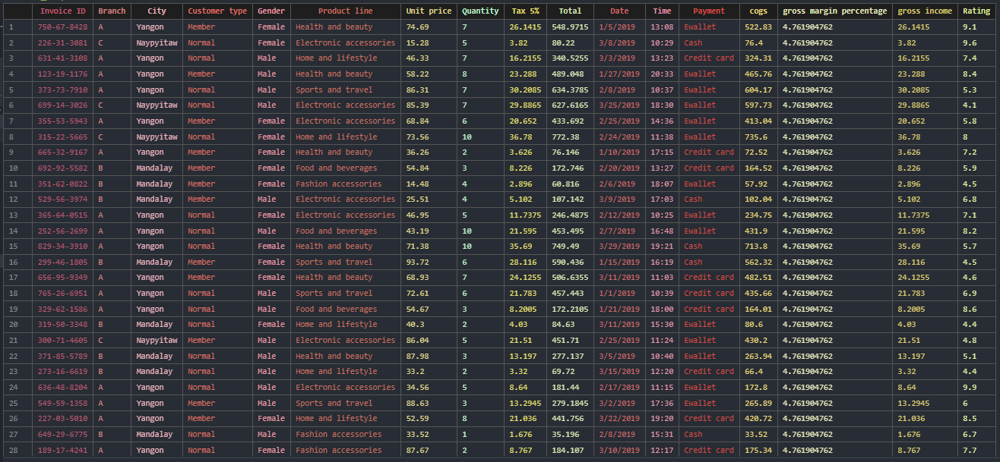
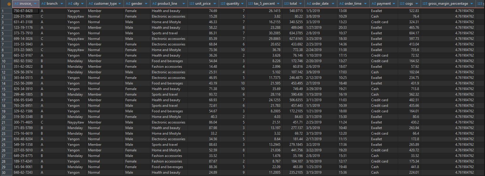
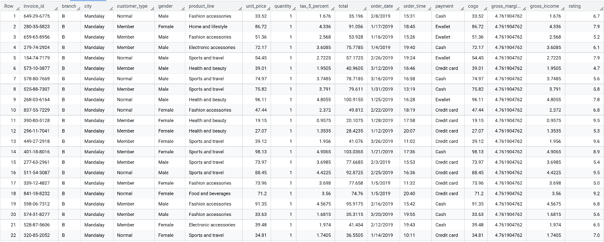
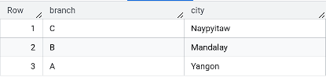
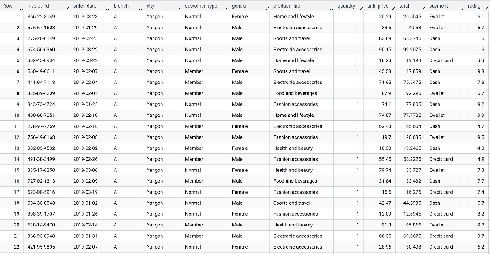

# 🛒 ELT Supermarket Sales Analytics

### Airflow | dbt | Docker | BigQuery

Proyek ini mengimplementasikan alur kerja Extract, Load, dan Transform (ELT) untuk data penjualan supermarket. Data mentah dari CSV diolah melalui PostgreSQL (sebagai staging database sementara), dimuat ke Google BigQuery, dan kemudian ditransformasi menjadi model data analitik menggunakan dbt (data build tool).

## 🧱 Arsitektur

Alur kerja ini diorkestrasi oleh Airflow dan memastikan data mengalir secara konsisten dari sumber ke data warehouse analitik.

1. **Extract/Load (Airflow Python):**
   Data mentah (CSV) dibaca, dibersihkan (terutama penamaan kolom menjadi snake_case), dan di-load ke dalam staging database lokal (PostgreSQL).

   - [Supermarket (.CSV)](data/supermarket.csv)
     
   - Raw Supermarket di Database Lokal (PostgresSQL)
     

2. **Load (Airflow Python):**
   Data yang sudah bersih ditarik dari PostgreSQL dan dimuat ke BigQuery. Data ini disimpan sebagai tabel data mentah: (`raw_transaction_supermarket`).

   - Raw Supermarket di BigQuery
     

3. **Transform (Airflow Bash/dbt):**
   dbt mengambil data di BigQuery dan membangun model data analitik:
   - Lapisan `staging_data`: Pembersihan mendalam dan standardisasi data.
     
   - Lapisan `marts_data`: Pembuatan tabel dimensi (`dim_supermarket_outlet`) dan tabel fakta (`fact_supermarket_sales`) yang siap untuk analisis dan visualisasi.
     1. `dim_supermarket_outlet`
        
     2. `fact_supermarket_sales`
        

## ⚙️ Prasyarat & Sumber Daya

Pastikan Anda memiliki alat berikut terinstal dan akun GCP sudah siap sebelum memulai:
|Tools|Deskripsi|Tautan Unduhan|
|-----|---------|--------------|
|Docker|Isolasi lingkungan untuk Airflow dan PostgreSQL.|[Docker Dekstop](https://www.docker.com/products/docker-desktop/)|
|Docker Compose|Manajemen multi-container.|(Termasuk dalam Docker Desktop)|
|GCP Account|Cloud platform untuk layanan BigQuery.|[Google Cloud Console](https://cloud.google.com/free)|
|Service Account Key|Kredensial yang diaktifkan untuk BigQuery.|(Dibuat di Konsol GCP)|

## 🚀 Setup & Deployment Cepat

Ikuti langkah-langkah ini untuk menjalankan seluruh stack ELT Anda secara lokal menggunakan Docker.

1.  **Kloning Repositori:**

    ```bash
    git clone https://github.com/nuralims/ELT-Supermarket-Sales-Analytics.git
    cd ELT-Supermarket-Sales-Analytics
    ```

2.  **Siapkan Kredensial & Data:**

    - Letakkan file kunci akun layanan GCP (`service_key.json`) Anda di direktori `./airflow/data/ `. Penting: File ini sudah diabaikan (`.gitignore`) dan tidak boleh di-commit.

    - Letakkan file CSV mentah Anda (`supermarket.csv`) di direktori `./airflow/data/`.

3.  **Jalankan Lingkungan (Docker Compose):**

    ```bash
    docker compose up -d --build
    ```

    Perintah ini akan membangun image Airflow kustom dengan dependensi dbt dan menjalankan layanan Airflow, PostgreSQL, dll.

4.  **Akses Airflow:**
    - Buka browser ke `http://localhost:8080` (login default: `airflow`/`airflow`).
    - Aktifkan DAG **`csv_to_warehouse`** dan jalankan secara manual.

## 💡 Konfigurasi dbt

Proyek dbt menggunakan profile `supermarket` dan skema target `marts_data` dan `staging_data` di BigQuery. Semua otentikasi BigQuery ditangani melalui **Service Account Key** yang di-mount ke container Airflow.
